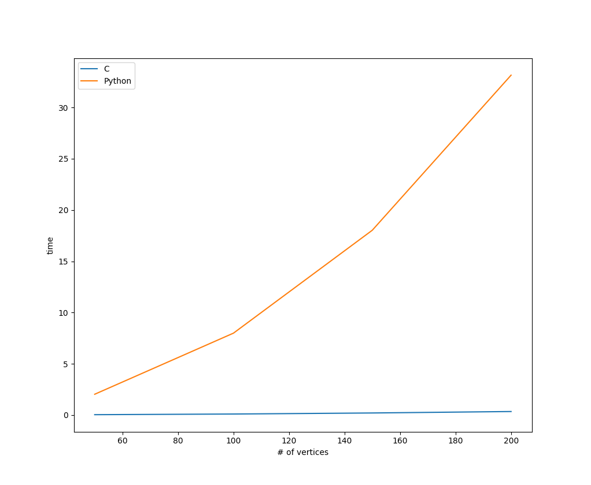
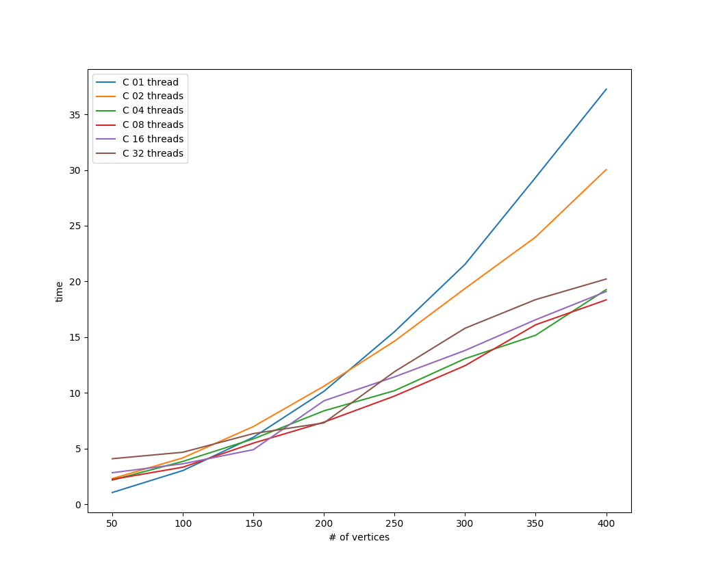

About
============
This is a toy module for generating graphs, laying them out, and experimenting with path-finding algorithms. I wrote this to satisfy my own curiosity, and the module doesn't have much use beyond that. It is implemented in Python 3 and has no requirements outside of the standard library. If you get impatient watching the O(n^2) layout algorithm, you can compile the C extension provided and speed things up ~%70.

Usage
============
Run the program with
```
$ python3 test.py
```


Select two nodes and click on an algorithm to find a path between them. The red nodes represent the chosen path and the yellow nodes were checked while looking for the path.


You can use command-line arguments to create a graph of a specific size
```
$ python3 test.py --vertices 100 --edges 75
```
Or to see other options enter
```
$ python3 test.py --help
```

Requirements
============
- Python 3

Optional
------------
If you want to try using the C extension the speed up the graph layout process you will need:
- Linux (Only tested on Ubuntu 16.10)
- python3-dev

Installation
============
Pure Python
------------
No installation required. Just clone the repository and
```
$ python3 test.py
```
With the C extension
------------
1. Make sure you have python3-dev installed...

    ```$ apt-get install python3-dev```
2. If you are working in a virtual envrionment you can install with

    ```$ python3 setup.py install```

    otherwise build it locally and move the .so file to the project's root directory.

    ```
    $ cd fdag
    $ python3 setup.py build
    $ cd ..
    $ mv fdag/build/lib.linux-x86_64-3.5/fdag.cpython-35m-x86_64-linux-gnu.so .
    ```

Bonus: Benchmarks
============
Plots are a requirement after spending the time to write a C extension.

The time values on the y axis are the amount of time required to run the graph layout algorithm N times. The values on the time axis on these two plots are not comparable because I was too impatient to run the Python benchmarks for the same N.

</img>

Looks like it was worth it.

</img>

I'm running this on a 4-core i7 (8 cores if you count hyperthreading) and the sweet spot seems to be between 4 and 8 threads.
