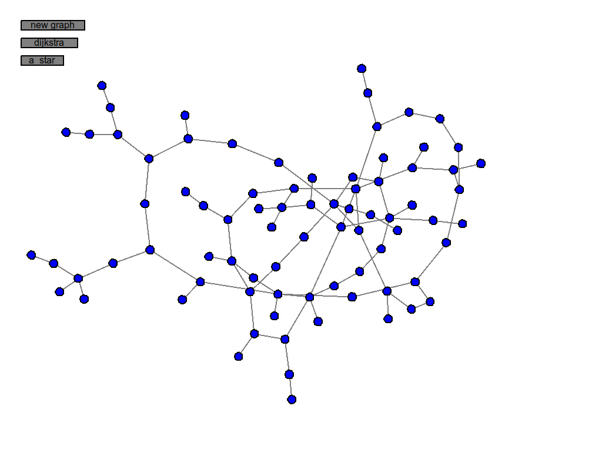

About
============
This is a toy module for generating graphs, laying them out, and experimenting with path-finding algorithms. I wrote this to satisfy my own curiosity, and the module doesn't have much use beyond that. It is implemented in Python 3 and has no requirements outside of the standard library. If you get impatient watching the O(n^2) layout algorithm, you can compile the C extension provided and speed things up ~%70.

Usage
============
Run the program with
```
$ python3 test.py
```


Select two nodes and click on an algorithm to find a path between them. The red nodes represent the chosen path and the yellow nodes were checked while looking for the path.



You can use command-line arguments to create a graph of a specific size
```
$ python3 test.py --vertices 100 --edges 75
```
Try ```$ python3 test.py --help``` for other options

Requirements
============
- Python 3

Optional
------------
If you want to try using the C extension the speed up the graph layout process
- Linux (Only tested on Ubuntu 16.10)
- python3-dev

Installation
============
Pure Python
------------
No installation required. Just clone the repository and
```
$ python3 test.py
```
With the C extension
------------
1. Make sure you have python3-dev installed...

    ```$ apt-get install python3-dev```
2. If you are working in a virtual envrionment you can install with

    ```$ python3 setup.py install```

    otherwise build it locally with

    ```$ python3 setup.py build```

Bonus: Benchmarks
============
[pic]
