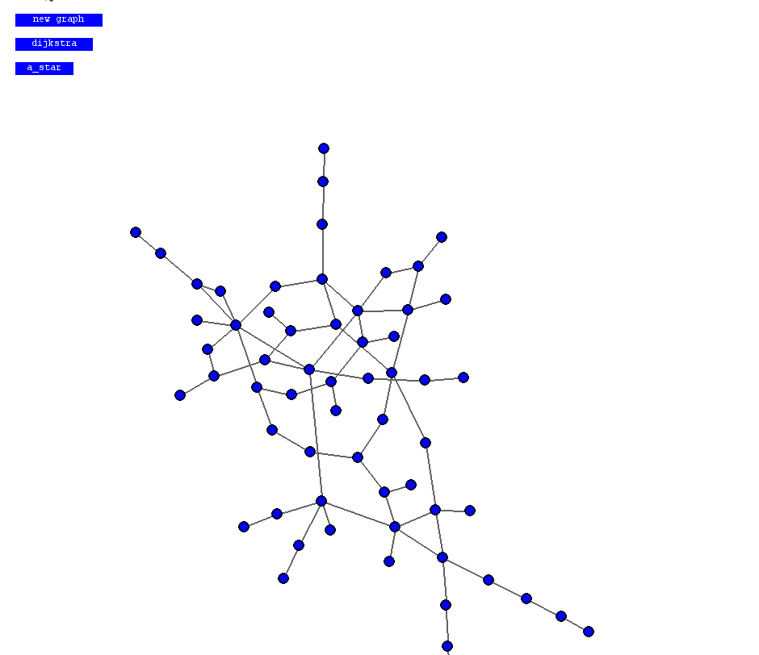
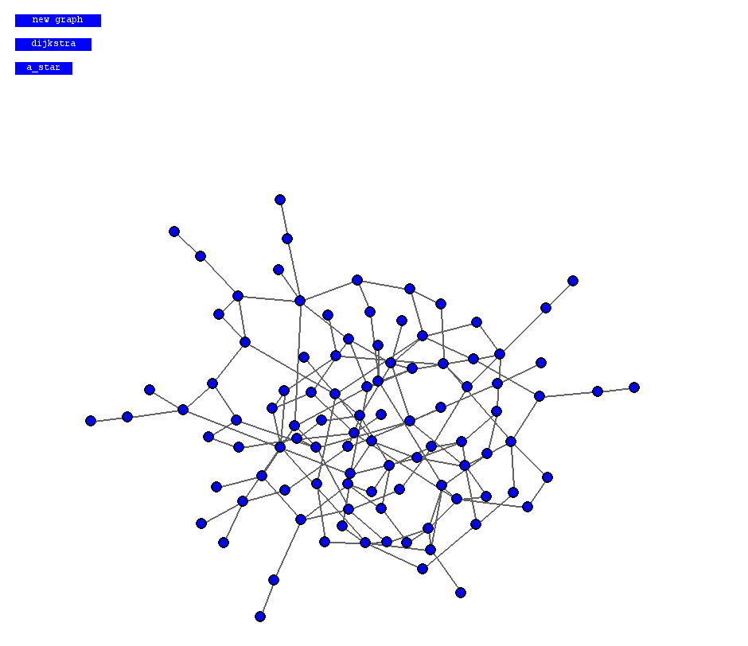

About
============
This is a toy module for generating graphs, laying them out, and experimenting with path-finding algorithms. If you get impatient watching the O(n^2) layout algorithm run, see below for instructions on compiling the C extension provided to speed things up.

Usage
============
Run the example with
```
$ python3 example.py
```


Select two nodes and click on an algorithm to find a path between them. The red nodes represent the chosen path and the yellow nodes were checked while looking for the path.



You can use command-line arguments to create a graph of a specific size
```
$ python3 example.py --vertices 100 --edges 75
```

Requirements
============
- Python 3
- Pygame (recommended)

Optional
------------
If you want to try using the C extension the speed up the graph layout process you will need:
- Linux (Only tested on Ubuntu 16.10)
- python3-dev

Compiling the C extension
============
1. Make sure you have python3-dev installed...

    ```$ apt-get install python3-dev```
2. If you are working in a virtual envrionment you can install with

    ```$ python3 setup.py install```

    otherwise build it locally and move the .so file to the project's root directory.

    ```
    $ cd graphy/fdag
    $ python3 setup.py build
    $ mv build/lib.linux-x86_64-3.5/fdag.cpython-35m-x86_64-linux-gnu.so ../../
    ```

Benchmarks
------------

</img>

</img>

